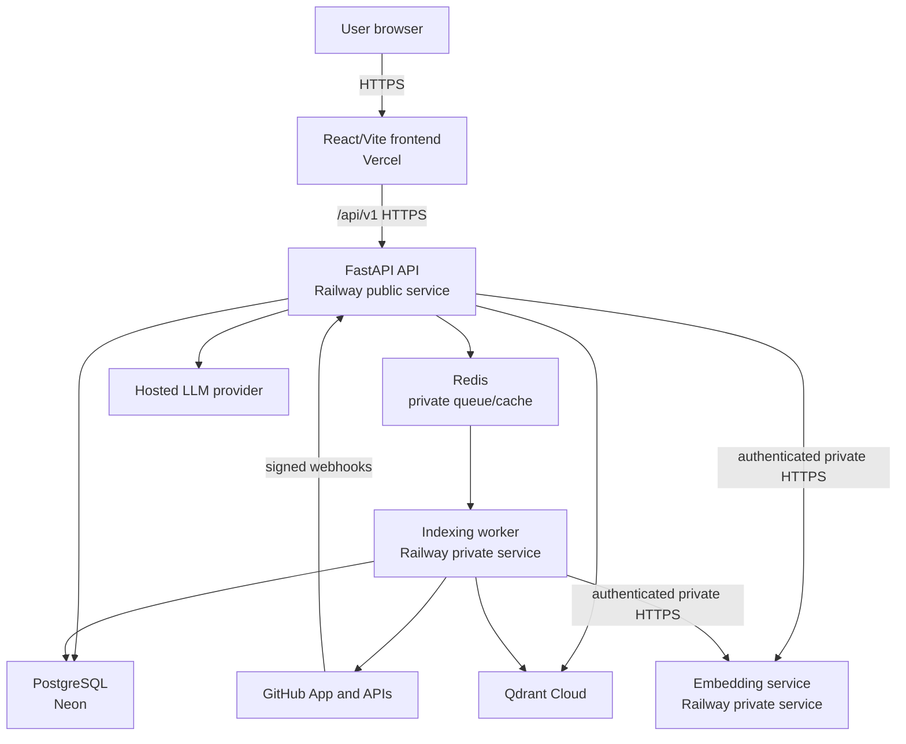

# RepoLume Architecture

**Status:** Milestone 2 authentication and GitHub App access implemented and locally verified with mocked GitHub responses. Live GitHub and hosted deployment verification remain outstanding.

## Goals

RepoLume is a multi-tenant, read-only repository intelligence SaaS. It authenticates users through a GitHub App, indexes only repositories authorized through an active installation, and answers repository-scoped questions using retrieved evidence. The first fully supported language is Python.

The architecture prioritizes tenant isolation, evidence provenance, recoverable background work, and the rule that connected repository code is data and is never executed.

## System context



Only the frontend, API, webhook route, and safe health routes are public. The worker, embedding service, Redis, and administrative job interfaces are private.

## Component boundaries

| Component | Responsibility | Must not do |
| --- | --- | --- |
| Frontend | Authentication states, repository management, progress, repository-scoped chat, sanitized evidence rendering | Store access tokens persistently; render untrusted HTML |
| API | **Through Milestone 2:** foundation, GitHub OAuth, RepoLume sessions, installation/repository authorization, and signed webhook ingress | Perform indexing in request handlers; trust a client repository ID; expose GitHub credentials |
| Worker | Claim durable jobs, clone safely, discover, parse, index, clean up, heartbeat | Expose a public endpoint; execute connected repository code |
| Embedding service | Load one configured model, validate authenticated batches, return deterministic vectors | Log raw chunks; accept public traffic |
| PostgreSQL | Migrated identity, hashed OAuth/refresh state, authorization relationships, repository state, webhook idempotency, and later product groundwork | Act as a vector similarity engine; persist raw browser or GitHub tokens |
| Redis | Queue delivery, ephemeral coordination, bounded caching and rate-limit support | Be the only record of a job or access decision |
| Qdrant | Repository- and index-version-filtered vector storage/search | Run unfiltered cross-repository searches |
| LLM adapter | Provider-independent tool selection and grounded synthesis | Choose tenant scope or network destinations |

## Monorepo boundaries

```text
backend/             FastAPI API, domain services, persistence, jobs, ingestion, tests
embedding_service/   Reserved for a later private model service; not created through Milestone 2
frontend/            Reserved for a later React/Vite application; not created through Milestone 2
docs/                Product, architecture, security, decisions, evaluation, status, operations
.github/              CI/CD and dependency automation
```

Within the backend, versioned routes delegate to auth, installation, webhook, and health services. GitHub access is isolated behind a typed client protocol with fixed destinations; database access remains behind explicit async service units of work. Cross-cutting token, cookie, configuration, error, logging, request-context, and response-security modules are separate from routes. Qdrant, Redis, embedding, worker, LLM, and frontend integrations do not exist.

## Implemented request paths

```text
Health:
  ASGI safeguards -> health service -> bounded PostgreSQL readiness check

GitHub login:
  state + PKCE generation -> hashed one-time state in PostgreSQL
  -> GitHub authorization redirect -> server-side code exchange
  -> GitHub user/installations sync -> RepoLume access + rotating refresh tokens

Protected installation/repository lookup:
  bearer validation -> server-loaded user -> fresh membership + active installation query
  -> server-minted installation token -> fixed GitHub repository API
  -> reauthorization -> repository access-state sync -> safe response

Webhook:
  bounded raw body -> HMAC-SHA256 validation -> payload validation
  -> delivery-ID insert-on-conflict -> immediate access-state transition
  -> processed/ignored/queued durable acknowledgement
```

Configuration is validated before the app is constructed. Production additionally requires JSON logging, disabled interactive docs, explicit trusted hosts, HTTPS CORS/callback URLs, a credentialed non-local PostgreSQL URL, PEM-shaped GitHub App key material, and authentication secrets of at least 32 characters. Secrets are excluded from settings representations and the allowlisted startup summary.

## Identity and authorization model

The implemented installation/repository authorization chain is:

```text
authenticated user
  -> active installation membership
  -> active GitHub App installation
  -> repository still selected for that installation
  -> RepoLume repository belongs to the installation
  -> requested session belongs to that repository
```

Services derive repository context from authorization-aware joins. Client identifiers are selectors, never proof of access. Membership must be within the configured freshness window, the installation must be active and undeleted, and the repository must be selected and unrevoked. The repository service reauthorizes after GitHub network work before committing synchronized state. Cross-tenant failure does not reveal resource existence.

GitHub user tokens exist only during callback synchronization. Installation tokens exist only during one repository request. RepoLume access tokens are short-lived signed bearer tokens. Browser refresh tokens are random opaque values; PostgreSQL stores only a keyed digest, family lineage, expiry/use/revocation state, and user relation. OAuth state and the PKCE verifier are also persisted only as keyed digests.

The relational model now actively supports users, installations/memberships, authorized repositories, content-free webhook delivery state, one-time OAuth state, and refresh-token families. The remaining Milestone 1 job/chat/index relations are still groundwork for later milestones.

## Database session strategy

RepoLume uses SQLAlchemy 2.x async sessions with `asyncpg` in FastAPI. The same bounded strategy is required for the later ARQ worker:

- One short-lived session per API request or explicit application-service unit of work, with rollback on failure and disposal during lifespan shutdown.
- One short-lived session per worker job step/transaction; no session remains open during clone, embedding, LLM, or other network work.
- `expire_on_commit=False`; ORM instances do not cross process or queue boundaries.
- Workers receive scalar identifiers, then reload and re-authorize durable state.
- Schema changes are made only through Alembic migrations; `f8eba5464d8c` adds Milestone 2 authentication/access state after `d2eea490eb59`.
- Transactions protect state transitions and atomic index activation; external side effects use idempotent operations and compensating cleanup rather than pretending they share a database transaction.

## Repository indexing data flow

1. API authenticates the user and verifies the complete installation/repository authorization chain.
2. API creates a PostgreSQL indexing job and enqueues its ID in Redis.
3. Worker claims the job, records start/heartbeat state, and re-verifies access.
4. Worker obtains a short-lived installation token and performs a fixed-argument, shallow, single-branch clone into a fresh temporary directory.
5. Discovery enforces configured file, byte, path, type, and symlink limits.
6. Static parsers create Python symbol-aware chunks and heading-aware documentation chunks without importing or running repository code.
7. The private embedding service embeds bounded batches; Qdrant writes are always tagged with repository ID and a new inactive index version.
8. PostgreSQL stores symbol and call-edge records under the same inactive version.
9. A transaction activates the new version only after all required stages succeed.
10. Failure preserves the last successful version and triggers cleanup of incomplete graph/vector data.
11. Temporary content is removed in a `finally` path.

Incremental indexing will be introduced only in Milestone 9. Until then, re-indexing is a full versioned rebuild.

## Grounded question flow

1. API authenticates the user, authorizes the session, verifies repository access is current, and derives repository ID plus active index version.
2. Server-controlled orchestration may call only `search_code`, `get_history`, and `find_callers`, with strict schemas, timeouts, and a four-call maximum.
3. Every vector operation includes mandatory repository and active-version filters.
4. Retrieved content is escaped and wrapped in structured untrusted-data delimiters.
5. The synthesis provider returns an evidence-backed result with status, confidence class, citations, and safe tool trace.
6. Unsupported, stale, partial, failed, or evidence-free questions return explicit non-success answer states instead of guesses.

The LLM never receives a shell, repository write capability, secret access, arbitrary networking, or authority to select tenant scope.

## Index consistency

`repositories.index_version` identifies the only active version. New vector, symbol, and edge records are written under a distinct inactive version. Activation updates the repository's version and indexed SHA in one database transaction after all external writes succeed. Searches read the active version from an authorized repository record and filter on both dimensions.

Cleanup is idempotent. A failed activation keeps the prior version queryable. A later reconciler removes orphaned inactive versions.

## Deletion model

Deletion is a durable asynchronous purge, not a cosmetic soft delete:

1. Access is blocked and status becomes `deleting`.
2. Pending jobs are cancelled or made no-ops through durable state.
3. All Qdrant points for every repository version are deleted with a repository filter.
4. Symbols, call edges, chats/messages, caches, and retained job data are purged according to the documented retention rule.
5. The repository record is deleted only after required purge steps are verified.
6. Failures remain visible and retryable; completion is never reported early.

Exact retention decisions will be finalized before deletion functionality is authorized.

## Availability and failure behavior

- Implemented liveness proves only that the API process can serve requests.
- Implemented readiness performs a bounded PostgreSQL `SELECT 1`, returns `200` only when it succeeds, and otherwise returns a safe `503` error envelope.
- GitHub dependency failures return safe `503` responses without response bodies, credentials, or provider error text.
- OAuth state is consumed before the code exchange so a failed or replayed callback cannot reuse it.
- Refresh rotation uses PostgreSQL row locks; replay of a used/revoked token invalidates its complete family.
- Installation and repository webhooks apply revocation in the request transaction before acknowledging. Push and non-deletion repository changes are recorded as durable `queued` deliveries for Milestone 3+ processing.
- PostgreSQL is the durable source of job state; Redis delivery is recoverable.
- Worker heartbeats and stuck-job reconciliation allow retry after restarts.
- Qdrant, embedding, or LLM outages return safe degraded states and do not activate partial indexes.
- GitHub revocation blocks reads immediately even when previously indexed data still exists pending purge.

## Deployment shape

- Frontend: Vercel, configured with the public API origin.
- API: public Railway service behind HTTPS.
- Worker and embedding service: separate private Railway services.
- PostgreSQL: Neon with pooling, backups, deliberate migrations, and least-privilege credentials.
- Redis: authenticated private managed service with persistence suitable for queue delivery.
- Vectors: authenticated Qdrant Cloud collection.
- Secrets: platform secret stores only.

The API has a hashed-dependency, non-root Python 3.13 container and a PostgreSQL-backed Compose baseline. Milestone 2 rebuilt it with PyJWT/cryptography, then verified UID/GID `10001:10001`, a read-only/no-capability runtime, startup, and both health endpoints. Production infrastructure and deployment details remain unverified until Milestone 12; no deployment currently exists.

## Known architectural limits

- No real GitHub App or hosted frontend is connected; GitHub adapter behavior is automatically verified with mocked responses only.
- Membership is synchronized at login and accepted for a configurable bounded freshness interval. Signed installation suspension/deletion and repository-removal webhooks override it immediately.
- Durable webhook `queued` state has no consumer until Milestone 3; no indexing work occurs in the request.
- Static Python analysis cannot prove dynamic dispatch, reflection, monkey patching, metaclass, decorator-generated, dependency-injection, or runtime-assignment behavior.
- Python is the only initially supported structured language.
- Repository evidence cannot establish actual runtime state or undocumented historical intent.
- Cross-service index activation requires idempotency and reconciliation because PostgreSQL and Qdrant do not share a transaction.
- External account, plan, quota, and private-network behavior must be verified against the selected providers before production deployment.
