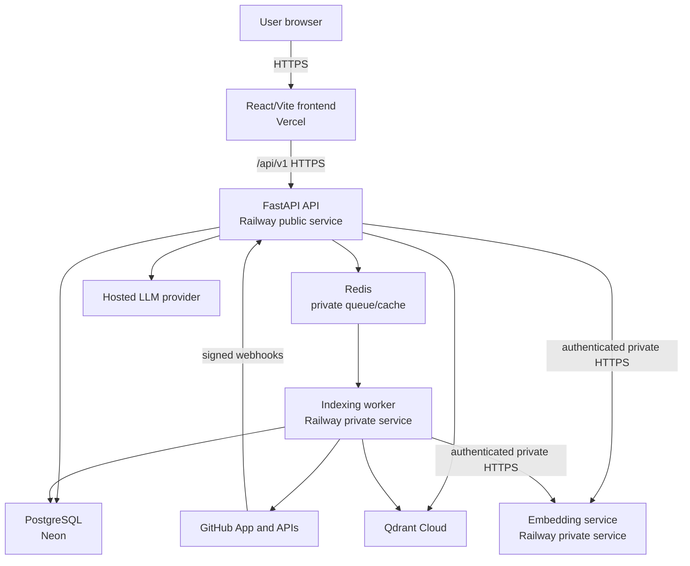

# RepoLume Architecture

**Status:** Milestone 5 private embeddings, Qdrant vector persistence, and PostgreSQL-authoritative atomic searchable index versions are implemented and locally verified with PostgreSQL 18, Redis 8.8, Qdrant 1.18.2, the exact pinned ONNX model, mocked GitHub responses, and controlled Git fixtures. Live GitHub and hosted deployment verification remain outstanding.

## Goals

RepoLume is a multi-tenant, read-only repository intelligence SaaS. It authenticates users through a GitHub App, indexes only repositories authorized through an active installation, and answers repository-scoped questions using retrieved evidence. The first fully supported language is Python.

The architecture prioritizes tenant isolation, evidence provenance, recoverable background work, and the rule that connected repository code is data and is never executed.

## System context



Only the frontend, API, webhook route, and safe health routes are public. The worker, embedding service, Redis, and administrative job interfaces are private.

## Component boundaries

| Component | Responsibility | Must not do |
| --- | --- | --- |
| Frontend | Authentication states, repository management, progress, repository-scoped chat, sanitized evidence rendering | Store access tokens persistently; render untrusted HTML |
| API | **Through Milestone 5:** foundation, GitHub OAuth/sessions, installation/repository authorization, signed webhooks, selection/status, and PostgreSQL/Redis/Qdrant readiness | Perform ingestion in request handlers; trust a client repository ID; expose source, vectors, or infrastructure details |
| Worker | **Through Milestone 5:** claim/recover/heartbeat, reauthorize, clone/discover/parse/chunk, call embeddings, write/validate scoped vectors, atomically activate, clean up | Expose a public endpoint; execute/import connected code; activate incomplete data; perform unscoped vector operations |
| Embedding service | Load and warm one immutable ONNX model, authenticate and bound batches, enforce token/output contracts, return deterministic normalized vectors | Receive GitHub/Redis/database credentials; log raw chunks/vectors; accept public traffic; load remote code |
| PostgreSQL | Identity/access, webhook/job truth, processing summaries, versioned symbols, index-build/count/activation/cleanup truth | Act as a vector engine; persist raw tokens, source bodies, or vector arrays |
| Redis | **Implemented:** at-least-once Stream delivery of opaque job UUIDs; later ephemeral cache/rate-limit support | Be the only record of a job or access decision; carry repository data or credentials |
| Qdrant | Complete citation-ready chunk payloads and normalized vectors under installation/repository/version scope | Decide active versions; store credentials; run unfiltered reads/counts/deletes/searches |
| LLM adapter | Provider-independent tool selection and grounded synthesis | Choose tenant scope or network destinations |

## Monorepo boundaries

```text
backend/             FastAPI API, domain services, persistence, jobs, ingestion, tests
embedding_service/   Private FastAPI/FastEmbed ONNX service, independent locks/image/tests
frontend/            Reserved for a later React/Vite application; not created through Milestone 5
docs/                Product, architecture, security, decisions, evaluation, status, operations
.github/              CI/CD and dependency automation
```

Within the backend, versioned routes delegate to auth, installation, repository, webhook, and health services. GitHub, Redis, embeddings, and Qdrant sit behind typed protocols. The private worker composes short PostgreSQL transitions, token minting, clone/discovery, a typed isolated analyzer, authenticated embedding batches, and scoped Qdrant writes; no ORM session remains open across Git/network/filesystem/parser/model work. Call resolution, public retrieval, LLM, agent, and frontend integrations do not exist.

## Implemented request paths

```text
Health:
  ASGI safeguards -> health service -> bounded PostgreSQL + Redis + Qdrant readiness

Private embeddings:
  worker service credential -> bounded typed batch -> fixed local ONNX model
  -> exact model/revision/dimension/normalization response -> hostile-response validation

GitHub login:
  state + PKCE generation -> hashed one-time state in PostgreSQL
  -> GitHub authorization redirect -> server-side code exchange
  -> GitHub user/installations sync -> RepoLume access + rotating refresh tokens

Protected installation/repository lookup:
  bearer validation -> server-loaded user -> fresh membership + active installation query
  -> server-minted installation token -> fixed GitHub repository API
  -> reauthorization -> repository access-state sync -> safe response

Webhook:
  bounded raw body -> HMAC-SHA256 validation -> payload validation
  -> delivery-ID insert-on-conflict -> immediate access-state transition
  -> processed/ignored/queued durable acknowledgement

Repository selection:
  bearer validation -> fresh membership + active installation
  -> server-minted installation token -> current GitHub repository list
  -> PostgreSQL row lock/idempotent initial job -> Redis job UUID -> HTTP 202

Worker:
  Redis job UUID -> conditional PostgreSQL claim -> durable authorization reload
  -> short-lived installation token -> fixed shallow clone -> bounded discovery
  -> parsing/chunking child -> safe summary + inactive symbols in PostgreSQL
  -> deterministic preprocessing -> authenticated bounded embedding batches
  -> inactive scoped Qdrant upsert/count/metadata validation
  -> PostgreSQL atomic activation -> superseded-version cleanup
  -> terminal/retry transition -> guaranteed clone cleanup -> Redis ACK
```

Configuration is validated before either app is constructed. Production additionally requires JSON logging, disabled API docs, explicit trusted hosts, HTTPS CORS/callback/embedding/Qdrant URLs, credentialed non-local PostgreSQL, authenticated TLS Redis and Qdrant, an absolute Git executable, PEM-shaped GitHub App material, and authentication/service secrets of at least 32 characters. Clone, discovery, parser, embedding document/batch/timeout, Qdrant batch/timeout, heartbeat, stream, and retry bounds are validated. Secrets are excluded from settings representations and allowlisted startup summaries.

## Identity and authorization model

The implemented installation/repository authorization chain is:

```text
authenticated user
  -> active installation membership
  -> active GitHub App installation
  -> repository still selected for that installation
  -> RepoLume repository belongs to the installation
  -> requested session belongs to that repository
```

Services derive repository context from authorization-aware joins. Client identifiers are selectors, never proof of access. Membership must be within the configured freshness window, the installation must be active and undeleted, and the repository must be selected and unrevoked. The repository service reauthorizes after GitHub network work before committing synchronized state. Cross-tenant failure does not reveal resource existence.

GitHub user tokens exist only during callback synchronization. Installation tokens exist only during one repository synchronization or worker clone. RepoLume access tokens are short-lived signed bearer tokens. Browser refresh tokens are random opaque values; PostgreSQL stores only a keyed digest, family lineage, expiry/use/revocation state, and user relation. OAuth state and the PKCE verifier are also persisted only as keyed digests.

The relational model now actively supports users, installations/memberships, authorized repositories, content-free webhook delivery state, one-time OAuth state, refresh-token families, and indexing job delivery/state. Chat, graph, and symbol relations remain groundwork for later milestones.

## Database session strategy

RepoLume uses SQLAlchemy 2.x async sessions with `asyncpg` in FastAPI and the worker:

- One short-lived session per API request or explicit application-service unit of work, with rollback on failure and disposal during lifespan shutdown.
- One short-lived session per worker job step/transaction; no session remains open during clone, embedding, LLM, or other network work.
- `expire_on_commit=False`; ORM instances do not cross process or queue boundaries.
- Workers receive scalar identifiers, then reload and re-authorize durable state.
- Schema changes are made only through Alembic migrations; `d06a6455fcd7` adds the Milestone 5 build/count/model/cleanup lifecycle after `f9389ed2964e`.
- Transactions protect state transitions and atomic index activation; external side effects use idempotent operations and compensating cleanup rather than pretending they share a database transaction.

## Repository indexing data flow

1. **Implemented:** API authenticates the user and verifies the complete installation/repository authorization chain against the current GitHub repository list.
2. **Implemented:** API creates an idempotent PostgreSQL indexing job, commits it, and enqueues only its ID in Redis.
3. **Implemented:** Worker conditionally claims the job, records progress/heartbeat/attempt state, and reloads durable access state.
4. **Implemented:** Worker obtains a short-lived installation token and performs a fixed-argument, shallow, single-branch clone into a fresh temporary directory.
5. **Implemented:** Discovery enforces configured file, byte, path, type, binary, directory, and symlink limits, then persists counts only and removes the clone.
6. **Implemented:** a resource-bounded child statically extracts Python symbols and creates deterministic Python/Markdown/text chunks without importing or running repository code. PostgreSQL stores inactive symbol definitions; chunk text is returned only transiently to the trusted worker.
7. **Implemented:** one central preprocessor serializes trusted citation metadata and complete content without truncation, fingerprints the policy/input, and rejects over-limit items. The worker sends bounded authenticated batches to the private service.
8. **Implemented:** the service loads `jinaai/jina-embeddings-v2-base-code` revision `516f4baf13dec4ddddda8631e019b5737c8bc250` through FastEmbed/ONNX CPU execution with an artifact allowlist and no remote code. It returns 768-dimensional L2-normalized vectors.
9. **Implemented:** deterministic UUIDv5 point IDs bind installation, repository, inactive version, path, stable chunk hash, type, and ordinal. Qdrant collection metadata fixes cosine/768/model/revision/L2; all writes, counts, scroll validation, and deletes use typed installation/repository/version filters.
10. **Implemented:** exact count plus commit/model/scope metadata validation marks the build ready. One PostgreSQL transaction locks the job/repository/build, supersedes the prior row, activates the new build, updates the repository active version/SHA/vector count, and completes the job.
11. **Implemented:** any pre-activation failure preserves the old active version, deletes only the failed inactive scope, records cleanup state, and keeps duplicate retries idempotent. Post-activation cleanup deletes only the superseded trusted scope.
12. Temporary clones are removed in a `finally` path.

Incremental indexing will be introduced only in Milestone 9. Until then, re-indexing is a full versioned rebuild.

## Grounded question flow

1. API authenticates the user, authorizes the session, verifies repository access is current, and derives repository ID plus active index version.
2. Server-controlled orchestration may call only `search_code`, `get_history`, and `find_callers`, with strict schemas, timeouts, and a four-call maximum.
3. Every vector operation includes mandatory repository and active-version filters.
4. Retrieved content is escaped and wrapped in structured untrusted-data delimiters.
5. The synthesis provider returns an evidence-backed result with status, confidence class, citations, and safe tool trace.
6. Unsupported, stale, partial, failed, or evidence-free questions return explicit non-success answer states instead of guesses.

The LLM never receives a shell, repository write capability, secret access, arbitrary networking, or authority to select tenant scope.

## Index consistency

`repositories.index_version` and `repository_index_builds.state='active'` identify the only active version. A partial unique index enforces one active build per repository; ready/active constraints require exact embedded/vector/expected counts with zero failed/skipped items. New vectors and symbols are written under a distinct inactive version. Activation updates the old/new build rows, repository version/SHA/count/status, and job in one transaction after all Qdrant validation succeeds. The old row is flushed as superseded before the new active row to keep the partial uniqueness invariant valid throughout transaction flush ordering.

Cleanup is idempotent and always uses trusted installation/repository/version filters. A failed activation keeps the prior version queryable. Failed inactive, retry-artifact, and just-superseded vector scopes are cleaned now; full repository deletion and general orphan reconciliation remain later lifecycle work.

## Deletion model

Deletion is a durable asynchronous purge, not a cosmetic soft delete:

1. Access is blocked and status becomes `deleting`.
2. Pending jobs are cancelled or made no-ops through durable state.
3. All Qdrant points for every repository version are deleted with a repository filter.
4. Symbols, call edges, chats/messages, caches, and retained job data are purged according to the documented retention rule.
5. The repository record is deleted only after required purge steps are verified.
6. Failures remain visible and retryable; completion is never reported early.

Exact retention decisions will be finalized before deletion functionality is authorized.

## Availability and failure behavior

- Implemented liveness proves only that the API process can serve requests.
- API readiness performs bounded PostgreSQL, Redis, and Qdrant configuration/readiness probes, returns `200` only when all succeed, and otherwise returns a topology-minimizing `503` response.
- Worker startup requires authenticated embedding-model readiness, exact Qdrant collection compatibility, Redis group setup, and PostgreSQL reconciliation before consumption.
- Embedding liveness is dependency-free; authenticated readiness reports only fixed model identity/revision/dimension/normalization/token ceiling and load state.
- GitHub dependency failures return safe `503` responses without response bodies, credentials, or provider error text.
- OAuth state is consumed before the code exchange so a failed or replayed callback cannot reuse it.
- Refresh rotation uses PostgreSQL row locks; replay of a used/revoked token invalidates its complete family.
- Installation and repository webhooks apply revocation in the request transaction before acknowledging. Push and non-deletion repository changes remain content-free durable delivery records; automatic reindex wiring is deferred beyond the initial Milestone 3 selection flow.
- PostgreSQL is the durable source of job state; Redis delivery is recoverable.
- Worker conditional claims prevent concurrent execution. Heartbeats, Redis pending-entry reclaim, delayed bounded retry, and PostgreSQL stuck-job reconciliation recover after restarts or Redis loss.
- Qdrant, embedding, or LLM outages return safe degraded states and do not activate partial indexes.
- GitHub revocation blocks reads immediately even when previously indexed data still exists pending purge.

## Deployment shape

- Frontend: Vercel, configured with the public API origin.
- API: public Railway service behind HTTPS.
- Worker and embedding service: separate private Railway services.
- PostgreSQL: Neon with pooling, backups, deliberate migrations, and least-privilege credentials.
- Redis: authenticated private managed service with persistence suitable for queue delivery.
- Vectors: authenticated Qdrant Cloud collection.
- Secrets: platform secret stores only.

The API and worker use one hashed-dependency, non-root Python 3.13.14/Git image on Debian 13. The independently deployable embedding image preloads the immutable model and runs local-only as UID 10002. Compose provides PostgreSQL 18, Redis 8.8, Qdrant 1.18.2, API, worker, and embedding service with persistent database/vector/model volumes. Production private networking, provider credentials, capacity, backups, and deployment remain unverified until later milestones; no deployment currently exists.

## Known architectural limits

- No real GitHub App or hosted frontend is connected; GitHub adapter behavior is automatically verified with mocked responses only.
- Membership is synchronized at login and accepted for a configurable bounded freshness interval. Signed installation suspension/deletion and repository-removal webhooks override it immediately.
- Initial selected-repository jobs can now complete a searchable vector version, but webhook-triggered reindex scheduling is not connected and no user-facing retrieval path exists.
- Static Python analysis cannot prove dynamic dispatch, reflection, monkey patching, metaclass, decorator-generated, dependency-injection, or runtime-assignment behavior.
- Python is the only initially supported structured language.
- Repository evidence cannot establish actual runtime state or undocumented historical intent.
- Cross-service index activation requires idempotency and reconciliation because PostgreSQL and Qdrant do not share a transaction.
- Qdrant now persists complete chunk text for later retrieval/citation; it must be treated as a private sensitive-content store with backups, deletion, encryption, and authorization controls equivalent to repository data.
- A version-scoped container-scan exception exists for CPython 3.13.14 `CVE-2026-15308`; the vulnerable `html.parser` path is outside these services' execution path and the exception must be removed when a fixed 3.13 maintenance release exists.
- External account, plan, quota, and private-network behavior must be verified against the selected providers before production deployment.
