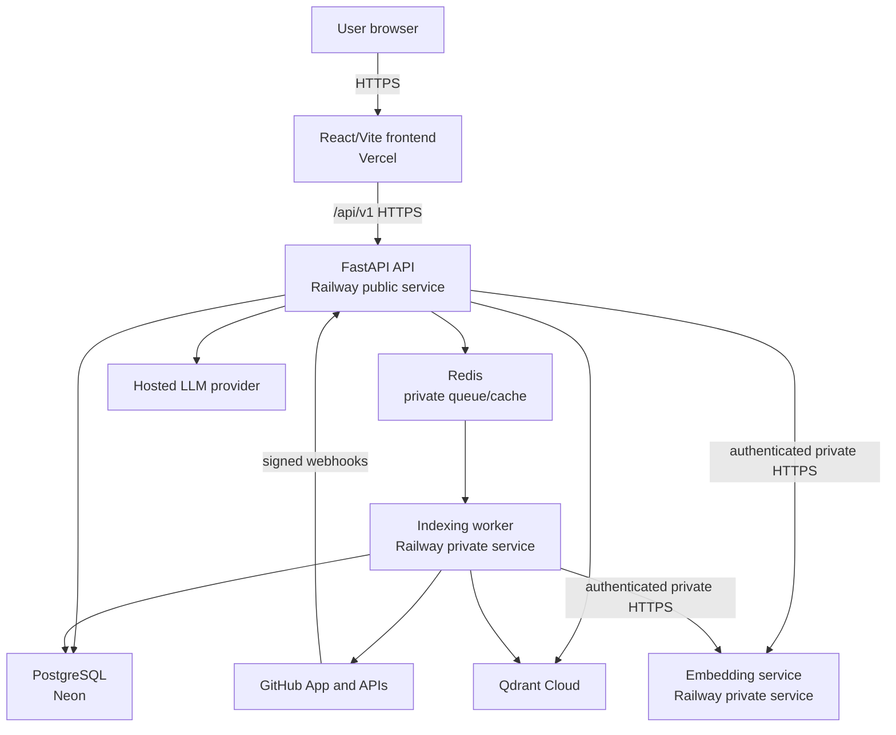

# RepoLume Architecture

**Status:** Milestone 10 adds a React/TypeScript/Vite browser client for the existing authenticated API, safe answer/evidence rendering, and a browser-safe OAuth completion redirect. Static parsing and call-graph construction remain conservative complete-target rebuilds. Live GitHub/hosted-model acceptance and deployment remain outstanding.

## Goals

RepoLume is a multi-tenant, read-only repository intelligence SaaS. It authenticates users through a GitHub App, indexes only repositories authorized through an active installation, and answers repository-scoped questions using retrieved evidence. The first fully supported language is Python.

The architecture prioritizes tenant isolation, evidence provenance, recoverable background work, and the rule that connected repository code is data and is never executed.

## System context



Only the frontend, API, webhook route, and safe health routes are public. The worker, embedding service, Redis, and administrative job interfaces are private.

## Component boundaries

| Component | Responsibility | Must not do |
| --- | --- | --- |
| Frontend | Authentication states, repository management, progress, repository-scoped chat, sanitized evidence rendering | Store access tokens persistently; render untrusted HTML |
| API | **Through Milestone 9:** foundation, GitHub OAuth/sessions, authorization, signed and bounded webhook ingress, durable freshness scheduling, manual full reindex, selection/status, readiness, and a bounded three-tool repository agent | Perform ingestion in request handlers; trust payload/model/client scope or filters; expose shell/arbitrary networking; persist raw webhook bodies/questions/prompts/answers/history evidence; expose vectors, prompts, or infrastructure details |
| Worker | **Through Milestone 9:** claim/recover/heartbeat, reauthorize, reject stale generations, repository-restricted compare/clone, discover/parse/chunk/build graph, selectively reuse/embed vectors, validate inactive state, atomically activate, clean up | Expose a public endpoint; execute/import connected code; activate incomplete/stale data; perform unscoped graph/vector operations |
| Embedding service | Load and warm one immutable ONNX model, authenticate and bound batches, enforce token/output contracts, return deterministic normalized vectors | Receive GitHub/Redis/database credentials; log raw chunks/vectors; accept public traffic; load remote code |
| PostgreSQL | Identity/access, webhook/job truth, processing summaries, versioned symbols, index-build/count/activation/cleanup truth | Act as a vector engine; persist raw tokens, source bodies, or vector arrays |
| Redis | **Implemented:** at-least-once Stream delivery of opaque job UUIDs; later ephemeral cache/rate-limit support | Be the only record of a job or access decision; carry repository data or credentials |
| Qdrant | Complete citation-ready chunk payloads and normalized vectors under installation/repository/version scope | Decide active versions; store credentials; run unfiltered reads/counts/deletes/searches |
| LLM adapter | Provider-independent strict tool/final decisions for the direct bounded loop | Choose tenant scope, tokens, URLs, raw filters, limits, revisions, or citation metadata |

## Monorepo boundaries

```text
backend/             FastAPI API, domain services, persistence, jobs, ingestion, tests
embedding_service/   Private FastAPI/FastEmbed ONNX service, independent locks/image/tests
frontend/            React/TypeScript/Vite SPA, typed API client, Vitest/Chromium tests, locked npm dependencies
docs/                Product, architecture, security, decisions, evaluation, status, operations
.github/              CI/CD and dependency automation
```

Within the backend, versioned routes delegate to auth, installation, repository, agent-question, webhook, and health services. GitHub, Redis, embeddings, Qdrant, and the hosted provider sit behind typed protocols. The immutable agent registry exposes only `search_code`, `get_history`, and `find_callers`; tools receive a server-built context and cannot choose tenant scope, versions, commits, destinations, or limits. The API holds no ORM session across embedding, Qdrant, GitHub, or LLM I/O and reauthorizes/rechecks the active build before returning. The frontend calls only the typed API client and has no direct GitHub, vector, worker, source-fetch, or chat-persistence boundary.

## Browser application boundary

The React client has sign-in, callback recovery, installation/repository selection, status-aware repository pages, a reindex confirmation, and a repository-scoped question workspace. It holds a short-lived access token only in memory. Refresh/logout send credentials to the API; the refresh token remains a scoped HTTP-only cookie and the browser does not write either token to storage, a URL, or logs.

For a deployed client, `FRONTEND_URL` is an HTTPS origin without a path/query/credentials and exactly matches `CORS_ORIGINS`. The GitHub callback is still the API: it consumes code/state server-side, sets the cookie, and redirects with HTTP 303 to the fixed frontend `/auth/callback` route without credential or OAuth values. That route refreshes the in-memory session normally. If `FRONTEND_URL` is absent in non-production, the original API JSON callback remains available for non-browser API integrations.

Answers are rendered with raw HTML disabled and `rehype-sanitize`; citation selection only displays server-returned metadata and excerpts. The client never fetches repository paths or model-provided URLs. Commit/PR links must parse as `https://github.com/...` before opening with `noopener noreferrer`. Browser integration tests use only intercepted API fixtures and Chromium; no browser test calls GitHub or real repository content.

## Implemented request paths

```text
Health:
  ASGI safeguards -> health service -> bounded PostgreSQL + Redis + Qdrant readiness

Private embeddings:
  worker service credential -> bounded typed batch -> fixed local ONNX model
  -> exact model/revision/dimension/normalization response -> hostile-response validation

GitHub login:
  state + PKCE generation -> hashed one-time state in PostgreSQL
  -> GitHub authorization redirect -> server-side code exchange
  -> GitHub user/installations sync -> RepoLume access + rotating refresh tokens

Protected installation/repository lookup:
  bearer validation -> server-loaded user -> fresh membership + active installation query
  -> server-minted installation token -> fixed GitHub repository API
  -> reauthorization -> repository access-state sync -> safe response

Webhook freshness:
  bounded raw body -> HMAC-SHA256 validation -> payload validation
  -> content-free delivery-ID insert-on-conflict -> trusted installation/repository row lock
  -> immediate access-state transition or default-branch generation/job creation
  -> commit durable state -> Redis opaque job UUID -> accepted/duplicate/ignored response

Repository selection:
  bearer validation -> fresh membership + active installation
  -> server-minted installation token -> current GitHub repository list
  -> PostgreSQL row lock/idempotent initial job -> Redis job UUID -> HTTP 202

Worker:
  Redis job UUID -> conditional PostgreSQL claim -> durable authorization reload
  -> generation check -> repository-restricted installation token -> fixed shallow clone
  -> fixed compare API from active SHA to cloned SHA -> bounded changed-file plan
  -> complete-target parsing/chunking/static-graph child -> inactive symbols/edges
  -> exact-scope unchanged-vector lookup + changed/new authenticated embedding batches
  -> inactive scoped Qdrant upsert/count/metadata validation + graph validation
  -> authorization/generation/branch recheck -> PostgreSQL compare-and-swap activation
  -> superseded-version cleanup
  -> terminal/retry transition -> guaranteed clone cleanup -> Redis ACK

Repository question:
  bearer validation -> active installation/repository authorization
  -> PostgreSQL-authoritative complete active build
  -> normalized bounded query -> strict provider tool/final decision
  -> search_code: private query embedding + mandatory scoped Qdrant search
  -> get_history: repository-restricted ephemeral GitHub token + fixed commit/PR paths
  -> find_callers: exact active repository/version/commit PostgreSQL graph query
  -> bounded untrusted evidence -> strict provider decision/final response
  -> current-trace mixed citation resolution -> authorization/version recheck
  -> explicit answer, partial answer, or non-answer plus content-free safe trace
```

Configuration is validated before either app is constructed. Production additionally requires JSON logging, disabled API docs, explicit trusted hosts, HTTPS CORS/callback/embedding/Qdrant/LLM URLs, credentialed non-local PostgreSQL, authenticated TLS Redis and Qdrant, an absolute Git executable, PEM-shaped GitHub App material, and authentication/service/provider secrets of at least 32 characters. Clone, discovery, parser, embedding, Qdrant, question, evidence, LLM, agent call/time/result/history/output, heartbeat, stream, concurrency, and retry bounds are validated. Secrets are excluded from settings representations and allowlisted startup summaries.

## Identity and authorization model

The implemented installation/repository authorization chain is:

```text
authenticated user
  -> active installation membership
  -> active GitHub App installation
  -> repository still selected for that installation
  -> RepoLume repository belongs to the installation
  -> requested session belongs to that repository
```

Services derive repository context from authorization-aware joins. Client identifiers are selectors, never proof of access. Membership must be within the configured freshness window, the installation must be active and undeleted, and the repository must be selected and unrevoked. The repository service reauthorizes after GitHub network work before committing synchronized state. Cross-tenant failure does not reveal resource existence.

GitHub user tokens exist only during callback synchronization. Installation tokens exist only during one repository synchronization or worker clone. RepoLume access tokens are short-lived signed bearer tokens. Browser refresh tokens are random opaque values; PostgreSQL stores only a keyed digest, family lineage, expiry/use/revocation state, and user relation. OAuth state and the PKCE verifier are also persisted only as keyed digests.

The relational model actively supports users, installations/memberships, authorized repositories, content-free webhook delivery state, one-time OAuth state, refresh-token families, indexing jobs/builds, versioned symbols, and validated versioned call edges. Chat relations remain groundwork for later milestones.

## Database session strategy

RepoLume uses SQLAlchemy 2.x async sessions with `asyncpg` in FastAPI and the worker:

- One short-lived session per API request or explicit application-service unit of work, with rollback on failure and disposal during lifespan shutdown.
- One short-lived session per worker job step/transaction; no session remains open during clone, embedding, LLM, or other network work.
- `expire_on_commit=False`; ORM instances do not cross process or queue boundaries.
- Workers receive scalar identifiers, then reload and re-authorize durable state.
- Schema changes are made only through Alembic migrations; head `4cafdf2faa66` adds Milestone 9 delivery, branch, generation, requested/actual-mode, change-count, reuse, and graph-refresh state after `b83f2d8a6c41`.
- Transactions protect state transitions and atomic index activation; external side effects use idempotent operations and compensating cleanup rather than pretending they share a database transaction.

## Repository indexing data flow

1. **Implemented:** API authenticates the user and verifies the complete installation/repository authorization chain against the current GitHub repository list.
2. **Implemented:** API creates an idempotent PostgreSQL indexing job, commits it, and enqueues only its ID in Redis.
3. **Implemented:** Worker conditionally claims the job, records progress/heartbeat/attempt state, and reloads durable access state.
4. **Implemented:** Worker obtains a short-lived installation token and performs a fixed-argument, shallow, single-branch clone into a fresh temporary directory.
5. **Implemented:** Discovery enforces configured file, byte, path, type, binary, directory, and symlink limits, then persists counts only and removes the clone.
6. **Implemented:** a resource-bounded child statically extracts Python symbols and calls, constructs the deterministic conservative call graph, and creates Python/Markdown/text chunks without importing or running repository code. PostgreSQL stores inactive symbol definitions and call edges; chunk text is returned only transiently to the trusted worker.
7. **Implemented:** one central preprocessor serializes trusted citation metadata and complete content without truncation, fingerprints the policy/input, and rejects over-limit items. The worker sends bounded authenticated batches to the private service.
8. **Implemented:** the service loads `jinaai/jina-embeddings-v2-base-code` revision `516f4baf13dec4ddddda8631e019b5737c8bc250` through FastEmbed/ONNX CPU execution with an artifact allowlist and no remote code. It returns 768-dimensional L2-normalized vectors.
9. **Implemented:** deterministic UUIDv5 point IDs bind installation, repository, inactive version, path, stable chunk hash, type, and ordinal. Qdrant collection metadata fixes cosine/768/model/revision/L2; all writes, counts, scroll validation, and deletes use typed installation/repository/version filters.
10. **Implemented:** exact vector count/commit/model/scope validation plus re-read graph counts/fingerprint mark the build ready. One PostgreSQL transaction locks the job/repository/build, supersedes the prior row, activates the new build, updates the repository active version/SHA/vector count, and completes the job.
11. **Implemented:** any pre-activation failure preserves the old active version, deletes only the failed inactive scope, records cleanup state, and keeps duplicate retries idempotent. Post-activation cleanup deletes only the superseded trusted scope.
12. **Milestone 9:** a default-branch push compares the active SHA to the independently cloned target. The planner validates normalized add/modify/remove/rename/copy paths. Missing ancestry, force pushes, no active version, unsafe/incomplete/large comparisons, target-byte limits, or missing reusable artifacts produce an explicit full fallback.
13. **Milestone 9:** incremental mode still creates a complete new version. Parsing/chunk generation and the static graph are rebuilt over the complete target tree because imports and ambiguity make narrower invalidation unsafe in the current schema. Only unchanged vectors with exact path/type/content/location/model/preprocessing identity are copied into the new version; changed/new chunks are embedded. This is selective vector reuse, not claimed selective parse reuse.
14. **Milestone 9:** repository `refresh_generation` is the compare-and-swap freshness authority. A newer push or manual reindex supersedes older queued/running work. The worker checks it before external work and immediately before activation. Questions continue to use the validated prior active version while a replacement is queued/building/failed.
15. Temporary clones are removed in a `finally` path.

## Bounded agent question flow

1. API authenticates the user and performs the full active installation/repository authorization join. Cross-tenant selectors receive the same non-enumerating not-found response.
2. PostgreSQL must show a nonzero active version/vector count and exactly one matching `active` build with the current commit, version, model, dimension, preprocessing fingerprint, and count. A queued/building/failed replacement may coexist; `not_indexed`, revoked, and deleting states fail closed.
3. Central preprocessing NFC-normalizes and folds whitespace while preserving identifiers, rejects controls and questions shorter than 3 characters or over 4,096 UTF-8 bytes/512 estimated tokens, and produces a prompt-version-bound SHA-256 fingerprint. Raw questions and query vectors are neither logged nor persisted.
4. The provider receives fixed `repolume-agent-v2` instructions and canonical JSON untrusted context. Its strict output is either one allowlisted typed tool call or a final answer/evidence-ID object. Repository IDs, installation IDs, tokens, URLs, raw filters, revisions, limits, and citation metadata are absent from the schema.
5. `search_code` calls the private service in query mode, validates the exact model/revision/one finite normalized vector, and searches Qdrant with mandatory server-derived installation/repository/active-version/commit/model/preprocessing scope. Existing deterministic evidence selection caps code evidence.
6. `get_history` reauthorizes the internal installation, mints a short-lived token restricted to the server-authorized GitHub repository, and uses only fixed commit/detail/associated-PR paths. It anchors at the active indexed SHA unless a valid SHA occurs in the original user question. Commit count, message, path, patch, PR body, HTTP time, and retry counts are bounded; nothing is persisted.
7. The loop permits at most four calls, eight seconds per tool, 45 seconds total, 32 KiB per result, 64 KiB total evidence, and 1,200 final output tokens by default. Unknown, extra, malformed, repeated, oversized, timed-out, and over-cap calls fail closed. Cancellation propagates.
8. Code, commit, patch, and PR text remain untrusted JSON. The provider may reference only deterministic evidence IDs. Server resolution rejects fabricated commit/PR IDs and emits code, commit, and pull-request citations in deterministic evidence order.
9. The service repeats authorization and active-build validation after external work. A changed version or revoked repository/installation fails closed.
10. The response is one of `answered`, `partially_answered`, `insufficient_evidence`, `unsupported_question`, or `temporarily_unavailable`. It includes indexed SHA/version, safe evidence/tool counts, duration, and a content-free trace. It excludes questions, evidence text beyond cited bounded excerpts, prompts, provider bodies, tokens, embeddings, point IDs, and vector topology.

`find_callers` accepts only a bounded symbol name and optional safe repository-relative file path. It reauthorizes the repository, requires the exact validated active graph/version/commit, resolves one target, and returns at most 20 deterministic caller records with confidence and static-analysis limitations. Missing or ambiguous targets yield insufficient evidence; graph/query/scope failures yield unavailable. The provider never receives a shell, write capability, secret access, arbitrary networking, SQL, or tenant/version authority.

## Index consistency

`repositories.index_version` and `repository_index_builds.state='active'` identify the only active version. A partial unique index enforces one active build per repository; application transitions require exact embedded/vector/expected counts, zero failed/skipped items, and a re-read SHA-256 graph fingerprint with `graph_validated=true`. New vectors, deterministic symbols, and deterministic call edges are written under a distinct inactive version. Activation proceeds only after Qdrant and graph validation; failed/superseded symbol deletion cascades only that version's call edges.

## Milestone 8/9 static call-graph flow

The existing resource-bounded child process walks Tree-sitter Python `call` nodes and attributes them only to enclosing function, async-function, or method definitions. It never imports or executes repository modules. The resolver recognizes same-file/nested names, direct and relative imports/aliases, module-qualified calls, constructors, `self`/`cls` methods, Unicode identifiers, and a unique repository-wide probable method. Duplicate candidates are persisted as low-confidence `ambiguous`; wildcards, reflection, call-return attributes, and other dynamic forms remain low-confidence `unresolved`.

Deterministic UUIDv5 symbol and call-site identities plus a SHA-256 graph fingerprint bind repository, inactive index version, source location, and commit. PostgreSQL stores call expression/location, resolved or unresolved target, resolution type, confidence, and build/job counts. The worker re-reads all inactive edges, recomputes counts/fingerprint, and blocks readiness and activation on any mismatch. Milestone 9 intentionally rebuilds the complete graph for every target version so changed imports, renamed modules, deleted definitions, and introduced/resolved ambiguity cannot leave stale edges.

Cleanup is idempotent and always uses trusted installation/repository/version filters. A failed activation keeps the prior version queryable. Failed inactive, retry-artifact, and just-superseded vector scopes are cleaned now; full repository deletion and general orphan reconciliation remain later lifecycle work.

## Deletion model

Deletion is a durable asynchronous purge, not a cosmetic soft delete:

1. Access is blocked and status becomes `deleting`.
2. Pending jobs are cancelled or made no-ops through durable state.
3. All Qdrant points for every repository version are deleted with a repository filter.
4. Symbols, call edges, chats/messages, caches, and retained job data are purged according to the documented retention rule.
5. The repository record is deleted only after required purge steps are verified.
6. Failures remain visible and retryable; completion is never reported early.

Exact retention decisions will be finalized before deletion functionality is authorized.

## Availability and failure behavior

- Implemented liveness proves only that the API process can serve requests.
- API readiness performs bounded PostgreSQL, Redis, and Qdrant configuration/readiness probes, returns `200` only when all succeed, and otherwise returns a topology-minimizing `503` response.
- Readiness deliberately does not call GitHub history or the hosted LLM; dependency failure is isolated to the question route and returns a partial or `temporarily_unavailable` result.
- Worker startup requires authenticated embedding-model readiness, exact Qdrant collection compatibility, Redis group setup, and PostgreSQL reconciliation before consumption.
- Embedding liveness is dependency-free; authenticated readiness reports only fixed model identity/revision/dimension/normalization/token ceiling and load state.
- GitHub dependency failures return safe `503` responses without response bodies, credentials, or provider error text.
- OAuth state is consumed before the code exchange so a failed or replayed callback cannot reuse it.
- Refresh rotation uses PostgreSQL row locks; replay of a used/revoked token invalidates its complete family.
- Installation and repository webhooks apply revocation in the request transaction before acknowledging. Default-branch pushes and default-branch metadata changes create durable versioned refresh jobs after signature, header, payload, installation, repository, branch, and idempotency validation. Non-default/deleted branches are ignored.
- PostgreSQL is the durable source of job state; Redis delivery is recoverable.
- Worker conditional claims prevent concurrent execution. Heartbeats, Redis pending-entry reclaim, delayed bounded retry, and PostgreSQL stuck-job reconciliation recover after restarts or Redis loss.
- Qdrant, embedding, or LLM outages return safe degraded states and do not activate partial indexes.
- GitHub revocation blocks reads immediately even when previously indexed data still exists pending purge.

## Deployment shape

- Frontend: Vercel, configured with the public API origin.
- API: public Railway service behind HTTPS.
- Worker and embedding service: separate private Railway services.
- PostgreSQL: Neon with pooling, backups, deliberate migrations, and least-privilege credentials.
- Redis: authenticated private managed service with persistence suitable for queue delivery.
- Vectors: authenticated Qdrant Cloud collection.
- Secrets: platform secret stores only.

The API and worker use one hashed-dependency, non-root Python 3.13.14/Git image on Debian 13. The independently deployable embedding image preloads the immutable model and runs local-only as UID 10002. Compose provides PostgreSQL 18, Redis 8.8, Qdrant 1.18.2, API, worker, and embedding service with persistent database/vector/model volumes. Production private networking, provider credentials, capacity, backups, and deployment remain unverified until later milestones; no deployment currently exists.

## Known architectural limits

- No real GitHub App or hosted frontend is connected; GitHub adapter behavior is automatically verified with mocked responses only.
- Membership is synchronized at login and accepted for a configurable bounded freshness interval. Signed installation suspension/deletion and repository-removal webhooks override it immediately.
- Initial/manual/full and webhook-triggered refresh jobs can complete searchable versions. The comparison adapter and signed deliveries are fully automated with controlled fixtures; real GitHub App acceptance remains pending credentials.
- Static Python analysis cannot prove dynamic dispatch, reflection, monkey patching, metaclass, decorator-generated, dependency-injection, or runtime-assignment behavior.
- Python is the only initially supported structured language.
- Repository/history evidence cannot establish actual runtime state or undocumented historical intent; commit messages alone are not treated as proof of causation.
- The deterministic local provider verifies protocol, refusal, citation, and isolation behavior, not hosted answer quality. No real OpenAI credential was available for local acceptance.
- The direct loop can combine bounded code, GitHub commit/PR, and statically resolved direct-caller evidence. Dynamic/runtime-only and live external-state questions remain explicitly unsupported.
- Cross-service index activation requires idempotency and reconciliation because PostgreSQL and Qdrant do not share a transaction.
- Qdrant now persists complete chunk text for later retrieval/citation; it must be treated as a private sensitive-content store with backups, deletion, encryption, and authorization controls equivalent to repository data.
- A version-scoped container-scan exception exists for CPython 3.13.14 `CVE-2026-15308`; the vulnerable `html.parser` path is outside these services' execution path and the exception must be removed when a fixed 3.13 maintenance release exists.
- External account, plan, quota, and private-network behavior must be verified against the selected providers before production deployment.
